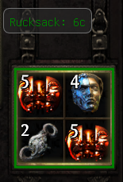
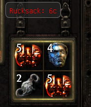
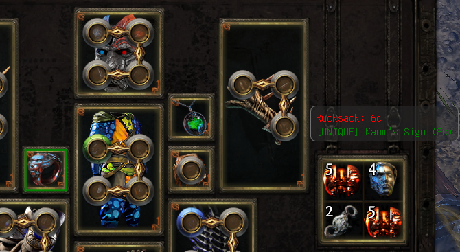
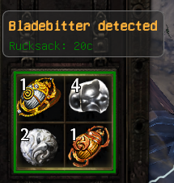

# MercValue

An [ExileApi](https://github.com/exApiTools/ExileApi-Compiled) plugin for Path of Exile's Mercenaries encounters. It prices the mercenary's reward live from [poe.ninja](https://poe.ninja) and tells you at a glance which of the two rewards - the currency rucksack or the best unique - is actually worth taking.

## Examples

| | |
|---|---|
|  |  |
| Rucksack clears the Minimum Value threshold - shown in green and framed. | Rucksack is below the Minimum Value threshold - shown in red, nothing framed. |
|  |  |
| The unique (Kaom's Sign) is worth more than the rucksack and clears its own threshold, so it wins the comparison instead. | A watched mercenary class ("Bladebitter") is detected - its custom alert message appears at the top of the box. |

## Core Features

- **Live pricing**: fetches current currency, scarab, and unique (weapon/armour/accessory) prices from poe.ninja for your configured league.
- **Rucksack total**: sums the chaos value of every currency/scarab item offered and shows it in a draggable overlay box.
- **Unique detection**: flags any unique on the mercenary priced at or above a threshold you set, individually valued.
- **Pick-one comparison**: since a mercenary only ever lets you take one reward, the rucksack total and the highest-priced qualifying unique are compared directly - whichever is actually worth taking is shown in green (and framed on screen), the other in red.
- **Merc Type Alerts**: pick specific mercenary classes (Sniper, Kineticist, etc.) from a dropdown and set a custom reminder message that appears whenever one shows up - e.g. *"Kineticist detected, check skill links"*.

## Install

### Requirements

- Path of Exile should be running in Windowed or Windowed Fullscreen mode.
- [ExileApi](https://github.com/exApiTools/ExileApi-Compiled).
- .NET 10 SDK.

### Install With PluginUpdater

1. Open [ExileApi](https://github.com/exApiTools/ExileApi-Compiled).
2. Open the `PluginUpdater` plugin.
3. Click the Add tab.
4. Paste `https://github.com/PoEExploitEnjoyer/MercValue` into Repository URL.
5. Click Clone.
6. Either restart ExileApi, or open ExileApi Core settings, scroll down, and press Reload Plugins.

### Install From Source Folder

1. Download or clone this repository.
2. Place the `MercValue` folder inside your `Plugins/Source/` directory.
3. Launch ExileApi.
4. Let the host compile the plugin.
5. Enable MercValue in the plugin settings.

## Getting Started

1. Enable the plugin.
2. Set **League** in settings to your current league's exact poe.ninja name (e.g. `Allflame`).
3. Prices fetch automatically on load, and again every **Auto Refresh** minutes - or hit **Refresh Prices Now** any time. **Price Status** shows whether the last fetch succeeded and when.
4. Open a mercenary encounter - a small draggable box appears near the reward window showing the rucksack's total value, any qualifying uniques, and a merc-type alert if one applies.

## How the pick-one comparison works

You can only take one reward from a mercenary, so MercValue treats the rucksack and the top-priced qualifying unique as competing options:

- If both clear their own threshold (**Minimum Value** for the rucksack, **Show Uniques Valued Above** for the unique), whichever is worth more wins and is shown/framed in green.
- If only one of them clears its own threshold, that one wins outright regardless of raw value - a below-minimum rucksack doesn't beat a cheap-but-qualifying unique just because it's numerically higher.
- If neither clears its threshold, neither is highlighted.

Chaos values are rounded half-up for both display and comparison, so a tie in what's shown on screen always favors the rucksack rather than being decided by a fractional difference you can't see.
